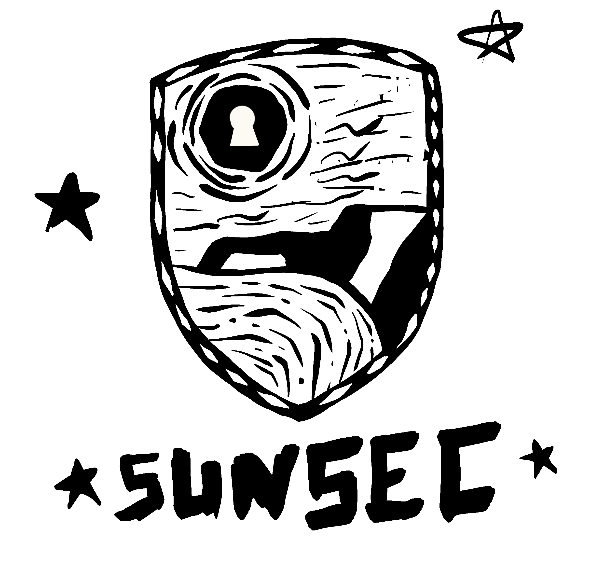

Sunsec, comunidade de segurança da informação em Natal-RN, onde estudantes, profissionais e entusiastas se conectam. Realizamos eventos locais e online, proporcionando uma plataforma para aprendizado, colaboração e networking para a nossa região. Aqui nos reunimos semanalmente para mergulhar em desafios de Capture The Flag (CTF) durante nossos eventos de estudo. Como verdadeiros potiguares, estamos empenhados em contribuir para o crescimento da segurança da informação em Natal e arredores. Seja parte disso, colaborando, ensinando e aprendendo. Vamos construir juntos a segurança do futuro.

[Website](https://sunsec.net)

## Missão
A Sunsec é uma comunidade dedicada a facilitar o crescimento conjunto através da colaboração. Estamos aqui para ajudar e prosperar coletivamente, promovendo um ambiente cooperativo de aprendizado em hacking e segurança da informação.

## Eventos
Toda quarta-feira, **#CTFNight** lá no Discord.
