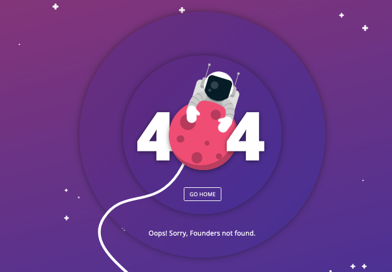

## Plugin anti-tretas erradas
Se observou em alguns grupos que a presença de fundadores só causa problemas e não tem nenhum beneficio aparente. Então escolhemos por utiliza o plugin anti-tretas erradas, que protege o coletivo contra a vulnerabilidade conhecida como `Founder Attack!!!`

Sempre faça questão de procurar os membros ativos caso precise de um representante. `#do-ocracy`

Lembrando que do-ocracy tb tem seus problemas, nem todo mundo tem tempo ou dinheiro para estar fazendo algo o tempo todo. Mas se você chegou até aqui, meia palavra para bom entendedor já basta.
