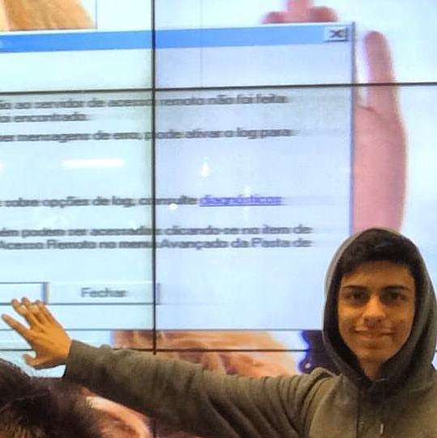

Fernando `Guisso` a.k.a h4ck4p0n3y a.k.a `hackaponey`

## Contato
[:spider_web: Website](https://guisso.dev/) | [:elephant: Mastodon](https://bolha.us/@guisso) | [:camera: PixelFed](https://bolha.photos/guisso) | [:cat: Github](https://github.com/fguisso)

## Sobre
Desmontava os brinquedos e tentava melhorias quando criança, porém sempre sobrava parafuso. Aprendeu com o tio a fazer sites no VillaBol e dai pra frente começou a se interessar por programação. Formado técnico em eletrônica, só para aprender a piscar um led no Arduino, coisa que infelizmente não aprendeu no curso. ~~Desde sempre achou~~ Já não acha mais Javascript a cosia ~~mais legal do mundo~~ e hoje usa isso ~~para tudo~~, paginas da web, servidores em node.js, criar [slides](https://github.com/fguisso/talks) para palestras, programar arduinos, raspberrys e drones. Usuário Javascript ~~Lover!!!~~

Vive em eventos de tecnologia, as vezes palestrando, as vezes organizando, as vezes ajudando e as vezes só participando. Além de Javascript, curti muito bitcoin, tanto a parte econômica da coisa, quanto a parte de desenvolvimento, programação. Pra finalizar, apesar de ter trabalhado bastante com segurança residencial, gosta de segurança da informação e esta sempre estudando meios de se defender, e quem sabe defender, sabe atacar!!

~~Duas~~Uma frase para você me conhecer:

> Ninguém é tão grande que não possa **aprender**, nem tão pequeno que não possa **ensinar**. *Esopo*
~~Perco o amigo, mas não perco a piada! *Tiririca*~~

## Interesses
- Aprender/Ensinar
- AppSec
- Hardware Hacking
- Drone Rancing
- Bitcoin/Blockchain
- Phreaking
- BioHacking
- ~~Pegar wifi do vizinho~~

## Projetos e atividades no `barraco`
- [:lock: Sunsec *Grupo de estudos sobre segurança da informação em Natal*](#)
- [:cake: NiverCon *Festinha de aniversario + evento tech*](#)
{.links-list}

## Demais atividades hacker
- ~~Voluntario no capitulo [OWASP Natal](https://owasp.org/www-chapter-natal/)~~
- Contribuidor nos projetos open-source [HuskyCI](https://github.com/globocom/huskyCI), [PorjectDiscovery Actions](https://github.com/projectdiscovery), [Decred Lightning](https://github.com/decred/dcrlnd).
{.grid-list}

#### Citação
Essa página é um update desta outra [página](https://garoa.net.br/wiki/Usu%C3%A1rio:FernandoGuisso) que criei a muito tempo atrás quando comecei a me envolver com a cultura hacker.
