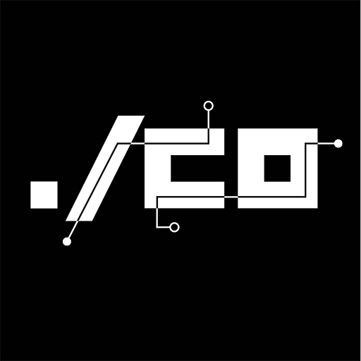


  **Atenção** esta pagina do /co é apenas um backup da antiga wiki. Por enquanto o /co esta apenas no [discord](https://discord.gg/tJHPjCKs) falando abobrinha.


 é um coletivo de tecnologia que adota a ética hacker como sua filosofia central. Acreditamos que compartilhar informações e dados com outros é um imperativo ético, e que o acesso a computadores - e a qualquer coisa que possa ensinar algo sobre como o mundo funciona - deve ser ilimitado e total. Acreditamos que a tecnologia deve ser usada para melhorar o mundo e que a descentralização é fundamental para promover a livre troca de informações.

Saiba mais sobre nós [aqui](/sobre).

## Nosso espaço
Atualmente não temos um lugar fisico fixo, mas visto que a maioria dos membros esta no nordeste, nesta região utilizamos a casa de alguns membros, suas oficinas de trabalho e as vezes espaços com parceiros como universidades e o SebraeRN.

## Próximos Eventos
Toda quinta-feira, **#CTFNight** da **[@Sunsec](/Sunsec/Sobre)** lá no Discord.

## Grupos de estudos
- [:speech_balloon: EletronLab *Estudos sobre cultura maker*](#)
- [:lock: Sunsec *Grupo de estudos sobre segurança da informação de Natal*](/Sunsec/Sobre)
{.links-list}

## Projetos
- [:cake: Nivercon *Evento/Aniversário do Open Source*](/Nivercon/Sobre)
{.links-list}

# Sobre

/co é um coletivo de tecnologia que adota a ética hacker como sua filosofia central. Acreditamos que compartilhar informações e dados com outros é um imperativo ético, e que o acesso a computadores - e a qualquer coisa que possa ensinar algo sobre como o mundo funciona - deve ser ilimitado e total. Acreditamos que a tecnologia deve ser usada para melhorar o mundo e que a descentralização é fundamental para promover a livre troca de informações.

O propósito do /co é promover a ética hacker e usar a tecnologia para melhorar o mundo. Nosso objetivo é criar um espaço(online e/ou fisico) onde os indivíduos possam aprender, compartilhar e colaborar em projetos tecnológicos que beneficiem a sociedade como um todo. Acreditamos que, ao promover a ética hacker, podemos desafiar a ideia de expertise tecnológica e autoridade, e dar poder aos cidadãos comuns sobre a tecnologia.

Acreditamos que, ao compartilhar nosso conhecimento e recursos, podemos contribuir para uma sociedade mais justa e igualitária. Nosso objetivo é criar um mundo onde a tecnologia é usada para o bem comum, e não para o benefício de poucos. Acreditamos que, ao adotar a ética hacker, podemos contribuir para a criação desse mundo.

## Sobre o nome
`barra + co` ou `barraco`, este é o nome do nosso coletivo. A barra simboliza um telhado de um barraco que pode ser de palha, madeira ou telha. A ideia a ser passada é que podemos subir uma telha em qualquer lugar e temos o nosso coletivo, o importante é evangelizar a cultura hacker.

Outro simbolismo para o nome é muito conhecido pelos brasileiros, barraco no sentido de brigas, tretas e furdúncio. Durante alguns anos nossos [founders](/membros/founders) participaram de outros hackerspaces e comunidades em volta da cultura hacker e claramente, não existe um grupo dessa forma que nunca teve um barraco. Sendo assim, assumimos que vamos ter barracos, mas de preferencia dos bons, que ajude a exercicitar a mente e criar novos projetos. Seguindo a ideia dos nossos amigos do [Calango Hackerpace](https://calango.club), `barraco` é a nova `treta` do nosso grupo. Leia mais sobre as [tretas do Calango](https://calango.club/seguraatreta/inicio).
