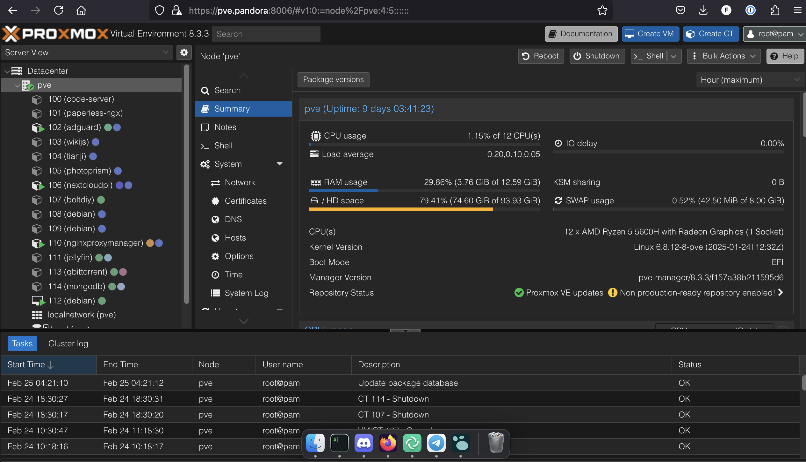

De uma olhada no meu artigo para detalhes sobre os assuntos: [Proxmox & Homelab](https://guisso.dev/misc/proxmox-debian-day/)

## Infraestrutura Base

- **Processador**: AMD Ryzen 5 5600H
- **Memória**: 16GB RAM
- **Armazenamento**: 
    - 500GB SSD
    - 500GB HDD
    - *Externo*: 1TB com case [**RAID1**](https://a.aliexpress.com/_mOk3SUj)

Se você estiver interessado, pode encontrar esse mini PC no [AliExpress](https://pt.aliexpress.com/item/1005003443853901.html).

- **Hypervisor**: Proxmox VE 8
- **Método de Deploy**: [helper-scripts.com](https://helper-scripts.com) para automatizar a criação de containers LXC e VMs.

## Aplicações em Produção

### Gerenciamento e Rede
- **[AdGuard Home](https://community-scripts.github.io/ProxmoxVE/scripts?id=adguard)**: Servidor DNS com bloqueio de anúncios e rastreadores.
  - **Config atual**:
    - vCPU: 1
    - RAM: 512MB
    - SWAP: 512MB
    - HDD: 2GB

- **[Nginx Proxy Manager](https://community-scripts.github.io/ProxmoxVE/scripts?id=nginxproxymanager)**: Gerenciamento de proxy reverso e [certificados SSL](/linux/commands/#openssl---gerar-certificado-autoassinado).
  - **Config atual**:
    - vCPU: 2
    - RAM: 1GB
    - SWAP: 512MB
    - HDD: 4GB

### Mídia e Downloads
- **[Jellyfin](https://community-scripts.github.io/ProxmoxVE/scripts?id=jellyfin)**: Servidor de mídia para streaming de filmes, séries e músicas.
  - **Config atual**:
    - vCPU: 2
    - RAM: 2GB
    - SWAP: 512MB
    - HDD: 12GB

- **[qBittorrent](https://community-scripts.github.io/ProxmoxVE/scripts?id=qbittorrent)**: Cliente torrent para downloads.
  - **Config atual**:
    - vCPU: 2
    - RAM: 2GB
    - SWAP: 512MB
    - HDD: 8GB

- **[PhotoPrism](https://community-scripts.github.io/ProxmoxVE/scripts?id=photoprism)**: Gerenciamento e organização de fotos com IA.
  - **Config atual**:
    - vCPU: 4
    - RAM: 2GB
    - SWAP: 1GB
    - HDD: 100GB

### Armazenamento e Documentos
- **[Nextcloud](https://community-scripts.github.io/ProxmoxVE/scripts?id=nextcloudpi)**: Nuvem pessoal para arquivos, calendários e contatos.
  - **Config atual**:
    - vCPU: 2
    - RAM: 2GB
    - SWAP: 512MB
    - HDD: 8GB

- **[Paperless-ngx](https://community-scripts.github.io/ProxmoxVE/scripts?id=paperless-ngx)**: Sistema de gerenciamento de documentos digitais.
  - **Config atual**:
    - vCPU: 2
    - RAM: 2GB
    - SWAP: 1GB
    - HDD: 12GB

### Máquinas Virtuais
- **[Debian 12](https://community-scripts.github.io/ProxmoxVE/scripts?id=debian-vm)**: VM para estudos sobre empacotamento no Debian.
  - **Config atual**:
    - vCPU: 2
    - RAM: 2GB
    - HDD: 20GB

## Acesso Externo

- **VPN**: [**Tailscale**](https://tailscale.com/)
- **Internet**: Pouco usado, quando preciso testar algo fora da VPN mas de forma externa: [**Cloudflare Tunnels**](https://developers.cloudflare.com/cloudflare-one/connections/connect-networks/)
## Próximos Passos

- [ ] Implementar sistema de backup automatizado.
- [ ] Wake on LAN.
