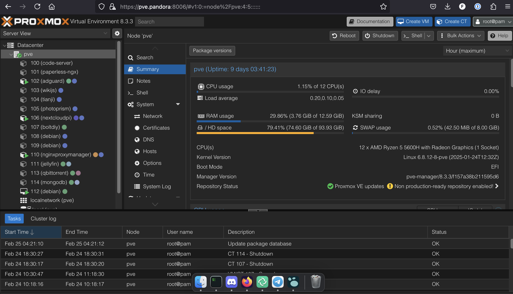

De uma olhada no meu artigo para detalhes sobre os assuntos: [Proxmox & Homelab](https://guisso.dev/misc/proxmox-debian-day/)

## Infraestrutura Base

- **Processador**: AMD Ryzen 5 5600H
- **Memória**: 16GB RAM
- **Armazenamento**:
    - 500GB SSD
    - 500GB HDD
    - *Externo*: 1TB com case [**RAID1**](https://a.aliexpress.com/_mOk3SUj)

Se você estiver interessado, pode encontrar esse mini PC no [AliExpress](https://pt.aliexpress.com/item/1005003443853901.html).

- **Hypervisor**: Proxmox VE 9
- **Método de Deploy**: [helper-scripts.com](https://helper-scripts.com) para automatizar a criação de containers LXC e VMs.

## Aplicações em Produção

### Gerenciamento e Rede
- **[AdGuard Home](https://community-scripts.github.io/ProxmoxVE/scripts?id=adguard)**: Servidor DNS com bloqueio de anúncios e rastreadores.

- **[Nginx Proxy Manager](https://community-scripts.github.io/ProxmoxVE/scripts?id=nginxproxymanager)**: Proxy reverso com SSL wildcard via DNS-01 Cloudflare.

- **[Zitadel](https://community-scripts.github.io/ProxmoxVE/scripts?id=zitadel)**: Identity provider para SSO/OAuth2 interno.

- **[Tianji](https://community-scripts.github.io/ProxmoxVE/scripts?id=tianji)**: Analytics e monitoramento. Similar ao Google Analytics + Uptime Kuma.

- **[The Lounge](https://community-scripts.github.io/ProxmoxVE/scripts?id=thelounge)**: Cliente IRC web.

### Mídia e Downloads
- **[Jellyfin](https://community-scripts.github.io/ProxmoxVE/scripts?id=jellyfin)**: Servidor de mídia para streaming de filmes, séries e músicas.

- **[Transmission](https://community-scripts.github.io/ProxmoxVE/scripts?id=transmission)**: Cliente torrent.

- **[Prowlarr](https://community-scripts.github.io/ProxmoxVE/scripts?id=prowlarr)**: Gerenciador de indexers para a stack arr.

- **[Radarr](https://community-scripts.github.io/ProxmoxVE/scripts?id=radarr)**: Automação de downloads de filmes.

- **[Sonarr](https://community-scripts.github.io/ProxmoxVE/scripts?id=sonarr)**: Automação de downloads de séries.

- **[Bazarr](https://community-scripts.github.io/ProxmoxVE/scripts?id=bazarr)**: Download automático de legendas.

- **[Jellyseerr](https://community-scripts.github.io/ProxmoxVE/scripts?id=jellyseerr)**: Portal de requisições de mídia integrado ao Jellyfin.

- **[MeTube](https://community-scripts.github.io/ProxmoxVE/scripts?id=metube)**: Download de vídeos do YouTube e outras plataformas.

- **[Lidarr](https://community-scripts.github.io/ProxmoxVE/scripts?id=lidarr)**: Automação de downloads de música.

- **[Navidrome](https://community-scripts.github.io/ProxmoxVE/scripts?id=navidrome)**: Streaming de música pessoal compatível com Subsonic.

### Documentos
- **[Paperless-ngx](https://community-scripts.github.io/ProxmoxVE/scripts?id=paperless-ngx)**: Gerenciamento de documentos digitalizados.

## Acesso Externo

- **VPN**: [**Unifi Teleport**](https://help.ui.com/hc/en-us/articles/4409740063511)
- **Internet**: [**Cloudflare Tunnels**](https://developers.cloudflare.com/cloudflare-one/connections/connect-networks/)

## Não usamos mais

- **[qBittorrent](https://community-scripts.github.io/ProxmoxVE/scripts?id=qbittorrent)**: Substituído pelo Transmission.

- **[Nextcloud](https://community-scripts.github.io/ProxmoxVE/scripts?id=nextcloudpi)**: Usado para fotos e arquivos. Desligado — o número de usuários (2) não justificou manter a complexidade. PhotoPrism cobria melhor o caso de fotos, e as demais features não foram relevantes no uso diário.

- **[PhotoPrism](https://community-scripts.github.io/ProxmoxVE/scripts?id=photoprism)**: Gerenciamento de fotos com IA. Parado — funcionou bem localmente mas teve problemas com o web player de vídeo quando exposto externamente. Em busca de alternativa.
